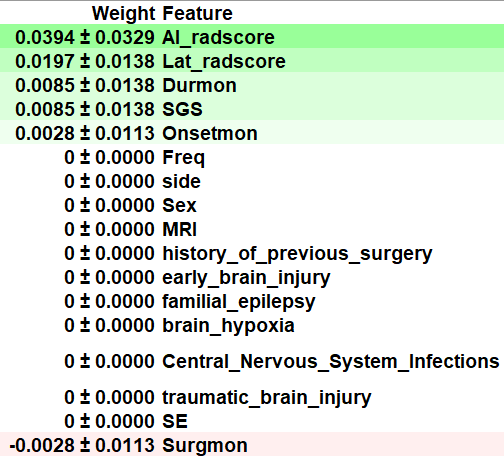

\setbeamercolor{titlelike}{bg=black,fg=white}
\newcommand\Background{%
\begin{tikzpicture}[remember picture,overlay]
\node[inner sep = 0pt, outer sep = 0pt,opacity=0.95]
  at (current page.center)
  {\includegraphics[width=\paperwidth,height=\paperheight]{images/GDMA.png}};
\end{tikzpicture}%
}

\def\begincols{\begin{columns}}
\def\begincol{\begin{column}}
\def\endcol{\end{column}}
\def\endcols{\end{columns}}

```{r setup, include=FALSE}

options(digits = 3)
knitr::opts_chunk$set(
  comment = "#>",
  echo = TRUE,
  message = FALSE,
  warning = FALSE,
  collapse = TRUE,
  out.width = "78%",
  fig.align = "center",
  fig.asp = 0.618, # 1 / phi
  fig.show = "hold"
)
```

```{r include=FALSE}
options(tibble.print_max = 5, tibble.print_min = 5)
library(showtext)
showtext_auto()
lgr::get_logger("mlr3")$set_threshold("warn")
lgr::get_logger("bbotk")$set_threshold("warn")
```

# Introduction 

## Background

```{r echo=FALSE, out.width=c("100%"), fig.cap="Epilepsy Epidemiology"}
knitr::include_graphics(c("images/global_epi.png"))
```

## Aims

```{r echo=FALSE, out.width=c("70%", "80%"),fig.cap="Focus on Interpretability of ML"}
knitr::include_graphics(c("images/Black-box.png", "images/xai.png"))
```

## Scheme

```{r echo=FALSE, out.width=c("85%"),fig.align="center", fig.cap="Flowchart of TLE Postsurgical IML"}
knitr::include_graphics(c("images/TLE_EML_Flow.png"))
```

# The Data

## Combined of PET Radiomics and Clinical Features

```{r echo=FALSE, out.width=c("110%"),fig.align="center", fig.cap="PET Radiomics  Score and Clinical-PET Features"}
knitr::include_graphics(c("images/PET_radiomics.png"))
```

## Exploratory Data Analysis

```{r echo=FALSE, out.width=c("60%"),fig.align="center", fig.cap="Heatmap of Clinical-PET Features"}
knitr::include_graphics(c("images/heatplot.png"))
```

# The Model

## Benchmark

**Table 1:** Performance Comparison Eleven ML algorithms and K-folds Cross-validation of the Selected AdaBoost
\begin{columns}
\column{.4\textwidth}
\begin{figure}
\centering
% Requires \usepackage{graphicx}
\includegraphics[width=6cm]{images/caret.png}
\end{figure}
\column{.5\textwidth}
\begin{figure}
\centering
% Requires \usepackage{graphicx}
\includegraphics[width=6cm]{images/k_fold_tuned_Ada.png}
\end{figure}
\end{columns}

## AdaBoost Algorithm

```{r echo=FALSE, out.width=c("80%"),fig.align="center", fig.cap="Illustration of AdaBoost Algorithm"}
knitr::include_graphics(c("images/AdaBoost.png"))
```
- `AdaBoostClassifier(algorithm='SAMME', base_estimator=None, learning_rate=0.2,
                   n_estimators=230, random_state=123)` 

# The Explanation 

## Permutation Importance

```{r echo=FALSE, out.width="60%", fig.align="center", fig.cap="Permutation Importance of AdaBoost"}

``` 

## Partial Dependence Plot

```{r echo=FALSE, out.width=c("35%","35%","35%")}
knitr::include_graphics(c("images/pdp_ai.png","images/pdp_Lat.png","images/pdp_surgmon.png"))
``` 

# Conclusion

## Key Points

- Metabolic radiomics are helpful to predict the postsurgical seizure outcomes;

- Combination of PET Radiomics and Clinical Features are more robust;

- IML technique can further deepen the understanding of the principle of ML models and the decision-making process for professional and intuitive interpretation

## Limitations

- More data, especially external validation cohort;

- Fusion of PET/MRI multimodal imaging;

- Other subtypes of drug-resistant epilepsy


## 

For more theoretical approaches to machine learning model explanation, see [Interpretable Machine Learning: A Guide for Making Black Box Models Explainable](https://christophm.github.io/interpretable-ml-book/),refer to[@beghi2019global],[@rajpurkar2021deep],[@mlr3book],[@molnar2022].

\bigskip

**Email:** wane199@outlook.com

## 

\begin{center}
  \emph{\textbf{\Huge{{THANKS !}}}}
\end{center}
\Background

