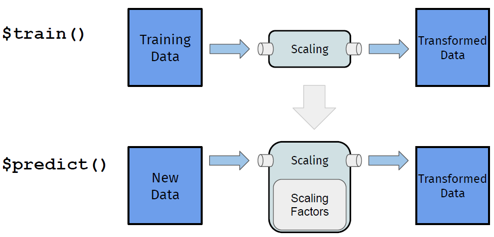

```{r setup, include=FALSE}
options(digits = 3)
knitr::opts_chunk$set(
  comment = "#>",
  echo = TRUE,
  message = FALSE,
  warning = FALSE,
  collapse = TRUE,
  out.width = "78%",
  fig.align = "center",
  fig.asp = 0.618, # 1 / phi
  fig.show = "hold"
)
```

```{r include=FALSE}
options(tibble.print_max = 5, tibble.print_min = 5)
library(showtext)
showtext_auto()
lgr::get_logger("mlr3")$set_threshold("warn")
lgr::get_logger("bbotk")$set_threshold("warn")
```

# Introduction
## 我的R书

```{r echo=FALSE, out.width=c("40%","25%")}
knitr::include_graphics(c("images/myRbook.png", "images/QR_code.png"))
```

- 电子抢读版今天上线（人邮）[异步社区](https://www.epubit.com/bookDetails?id=UB7db2c0db9f537&tabName=%E6%8A%A2%E8%AF%BB%E7%89%88&floorName=%E7%B2%BE%E9%80%89%E7%BA%B8%E4%B9%A6)
- 纸质版预计2022年12月10日上市（受北京疫情影响可能会晚约半个月）

# Methods
## 6. 基准测试

**基准测试**（`benchmark`），用来比较不同学习器（算法）、在多个任务（数据）和/或不同重抽样策略（多个数据副本）上的平均性能表现。

基准测试时有一个关键问题是，测试的公平性，即每个算法的每次测试必须在相同的重抽样训练集拟合模型，在相同的重抽样测试集评估性能。

例如，

- 选取一个自带的二分类任务
- 选取多个学习器：决策树、`KNN`、随机森林、支持向量机
- 创建基准测试“设计”（每个学习器不能只凭一次结果，采用$5$折交叉验证的平均结果）
- 查看性能指标：准确率、`AUC`值
- 箱线图展示`AUC`值的对比结果

##


## 三. 图学习器

一个管道运算（`PipeOp`），表示机器学习管道中的一个计算步骤。一系列的`PipeOps`通过边连接（`%>>%`）构成图（`Graph`），图可以是简单的线性图，也可以是复杂的非线性图。

这让我们可以像搭建积木一样，搭建出复杂的图，数据将沿着搭建好的图流动，完成从预处理到机器学习算法构成的整个过程：

- 选取`PipeOp`, 通过`%>>%`、`gunion()`、`ppl()`等搭建图
- `Graph$plot()`绘制图的结构关系；
- `as_learner(Graph)`将图转化为学习器，即可跟普通学习器一样使用

管道、图学习器主要用于：

- 特征工程：缺失值插补、特征变换、特征选择、处理不均衡数据……
- 集成学习：装袋法、堆叠法
- 分支训练、分块训练

## 1. 特征工程

机器学习中的数据预处理，也统称为**特征工程**，主要包括：缺失值插补、特征变换，目的是提升模型性能。

- 选择特征工程步相应的`PipeOp`；
- 多个特征工程步通过管道符`%>>%`连接；
- 很多`PipeOp`都支持`affect_columns`参数（接受`Selector`选择器）

# Results 
## 

```{r echo=FALSE, out.width="75%", fig.align="center", fig.cap="特征工程管道示意图"}

``` 

##

- 选择3个学习器：`KNN、SVM、Ranger`作为三分支分别拟合模型，再合并分支：


- `method`: 调参方法，支持"grid_search"（网格搜索）、"random_search"（随机搜索）、gensa（广义模拟退火）、"nloptr"（非线性优化）。

## 六. 特征选择

当数据集包含很多特征时，只提取最重要的部分特征来建模，称为特征选择。特征选择可以增强模型的解释性、加速学习过程、改进学习器性能。

### 1. 过滤法

**过滤法**，基于某种衡量特征重要度的指标（如相关系数），用外部算法计算变量的排名，只选用排名靠前的若干特征，用`mlr3filters`包实现。

(1) 基于[重要度指标](https://mlr3filters.mlr-org.com/#implemented-filters)

过滤法给每个特征计算一个重要度指标值，基于此可以对特征进行排序，然后就可以选出特征子集。

# Conclusions
##

(2) 基于学习器的变量重要度

有些学习器可以计算变量重要度，特别是基于树的模型。有些学习器需要在创建时"激活"其变量重要性度量。例如，通过`ranger`包来使用随机森林的"impurity"度量：


##

使用上述特征选择可以对特征得分可视化，根据肘法确定保留特征数，然后用`task$select()`选择特征；也可以直接通过管道连接学习器构建图学习器：

## 2. 包装法

**包装法**，随机选择部分特征拟合模型并评估模型性能，通过交叉验证找到最佳的特征子集，用`mlr3fselect`包实现。

包装法特征选择，与超参数调参道理完全一样，支持：

- 独立特征选择过程：`fselect()`
- 自动特征选择器：`auto_fselector()`, 封装成学习器，可用于重抽样或基准测试
- 嵌套重抽样特征选择：`fselect_nested()`


另外，有些学习器内部提供了选择有助于做预测的特征子集的方法，称为**嵌入法**。

## 七. 模型解释

机器学习模型预测性能强大，但天生不好解释。`R`有两个通用框架致力于机器学习模型的解释（支持但不属于`mlr3verse`）：`iml` 包和`DALEX`包。

可以从特征层面（特征效应、夏普利值、特征重要度）、观测层面（探索模型在单个观测上的表现）给出指标和可视化的模型解释，具体请参阅[《R机器学习：mlr3verse技术手册》](https://gitee.com/zhjx19/rconf15)[@mlr3manual]。

更多机器学习模型解释理论方法，请参阅[Interpretable Machine Learning: A Guide for Making Black Box Models Explainable](https://christophm.github.io/interpretable-ml-book/)

##
<!--  -->
研究主要参阅[@rajpurkar2021deep], [@mlr3book], [@molnar2022]。感谢在`Github`提供的`R markdown`模板。

《`R`机器学习：基于`mlr3verse`》，预计2024年上半年上市，我也有计划在寒假期间开设R机器学习培训班，敬请期待！

**Email:** wane199@outlook.com

##

```{r echo=FALSE, out.width="100%"}
knitr::include_graphics(path = "images/GDMA.png")
```
