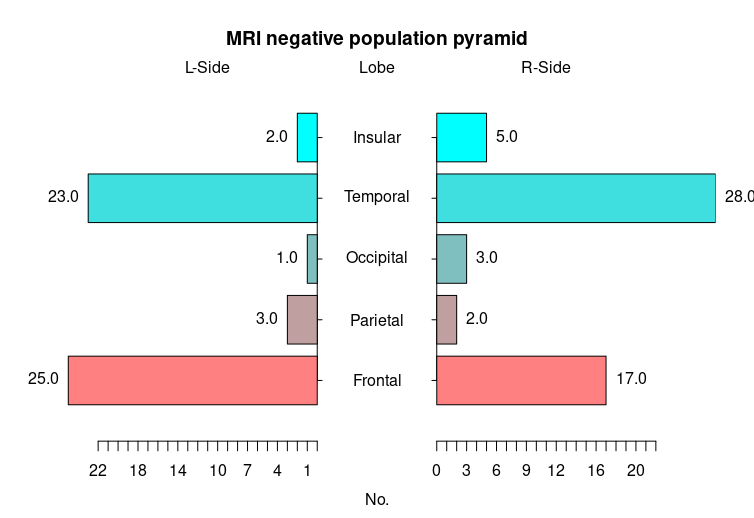

class: center, middle, inverse
background-image: url("images/brain.jpeg")
```{r xaringan-themer, include=FALSE, warning=FALSE}
library(xaringanthemer)
style_mono_accent(
  base_color = "#1c5253",
  header_font_google = google_font("Josefin Sans"),
  text_font_google   = google_font("Montserrat", "300", "300i"),
  code_font_google   = google_font("Fira Mono")
)
```
```{r xaringan-logo, echo=FALSE}
xaringanExtra::use_logo(
  image_url = "https://www.jd120.com/upload/2201/20221139075.gif"
)
```
```{r xaringan-tile-view, echo=FALSE}
xaringanExtra::use_tile_view()
```
```{r xaringan-scribble, echo=FALSE}
xaringanExtra::use_scribble()
```
```{r xaringan-editable, echo=FALSE}
xaringanExtra::use_editable(expires = 1)
```
```{r xaringanExtra, echo = FALSE}
xaringanExtra::use_progress_bar(color = "grey", location = "bottom")
```
```{r xaringanExtra-clipboard, echo=FALSE}
xaringanExtra::use_clipboard()
```
```{r xaringan-editable, echo=FALSE}
```

.bold[## Team Seminar Weekly]

.black[Reporter: Huanhua Wu<br>]

.bold[Supervisor: Hao Xu]

PET/CT-MRI, JNU

`r Sys.Date()`
---
# 吴环华工作汇报0718

--
## First
A broad learning system for 18F–FDG PET/MRI imaging diagnosis in
temporal lobe epilepsy patients


--
分层分析（定侧）

--
## Second 
MLP模型拟合。

---
class: center, middle
```{r echo=FALSE,out.width="100%"}
knitr::include_graphics("./images/Framework.png")
```
.footnote[Proposed Framework]

---
.center[
```{r echo=FALSE,out.width="100%"}
knitr::include_graphics("./images/venn.png")
```
.footnote[数据集取交集]
]

---
.pull-left[
PET
]


---
---
# 吴环华工作汇报0711

--
## First
年会摘要投稿(经典机器学习算法):

--


1、基于FDG PET代谢影像组学的一种新型评分系统用于颞叶癫痫术后复发预测(Coxph);
  
--

2、基于18F-FDG PET影像组学的可解释性机器学习模型预测颞叶癫痫患者术后早期复发(DT、RF、GBDT);

--

3、18F-FDG PET影像组学特征在颞叶癫痫患者术前诊断价值的研究(LR、NB、SVC、RF)。

--
## Second 
MLP神经网络搭建。

---
## Third
234例颞叶癫痫数据集(3~60 y,23.5y)年龄分层，31例儿童患者（13.2%，3~17 y, 15.0y）。

---
```{r echo=FALSE,out.width="90%"}
knitr::include_graphics("./images/child.png")
```

---

---
```{r echo=FALSE,out.width="80%"}
knitr::include_graphics("./images/Calib.png")
```
---
class: center, middle
.center[
| Classifier |  Birer loss | Log loss | Precison | Recall| F1 | AUC | 
| :-----: |  :-----: | :-----: | :-----: |  :-----: | :-----: |
| Logistic |  0.08 | 0.31 | 0.93 |0.94|0.93|0.89|
| Naive Bayes|0.22 | 1.89 | 0.84 |0.79|0.81|0.72|
| SVC|0.18 | 0.52 | 0.94 |0.93|0.93|0.90|
| Random Forest|0.13 | 0.40 | 0.87 |0.85|0.86|0.78|
]
???
Recall: 查全率也称为召回率，等价于灵敏性（Sensitivity）和真正率（True Positive Rate，TPR）
---
---
# 吴环华工作汇报0704

--
## First
MRIneg dataset预处理及标签文件创建；

--
## Second 
[复发预测模型文章撰写](https://github.com/wane199/Presentation/blob/master/BLS_EP/BLS_EP.pdf);

--
## Third
癫痫PET图像的组水平结构协变网络(SCNs)测试。
???
[xaringan of Rmarkdown to  render PPT](https://www.jianshu.com/p/222676cf2054)

xaringan::inf_mr() preview

Rmarkdown: $^{18}$F-FDG

overleaf: \usepackage{mhchem}  \ce{^{18}F-FDG}

---

## AAL116 Nets

.pull-left[
CN


]

.pull-right[
EP


]
---

---
---
# 吴环华工作汇报0627

## First
98例MRI阴性图像(MRIneg dataset)预处理及标签文件创建；

## Second 
[复发预测模型文章撰写](https://github.com/wane199/Presentation/blob/master/BLS_EP/BLS_EP.pdf)；

## Third
数据预处理到模型部署的pipeline梳理。
---

---

---
class: center, middle

# THANKS!

Data Source Provided by 999 Hospital, Guangzhou.

[**wane199**]()<br>
[wane199@outlook.com](https://github.com/gadenbuie/xaringanthemer).

