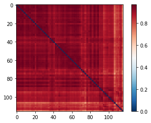
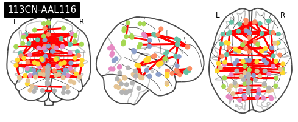
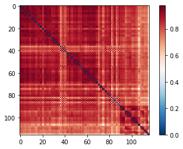
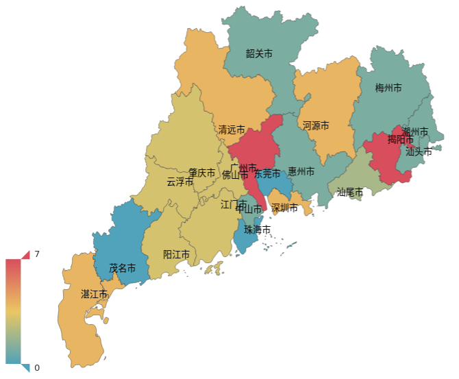

# 吴环华工作汇报0704
## First
98例MRI阴性图像(MRIneg dataset)预处理及标签文件创建；

## Second 
复发预测模型文章撰写；

## Third

---

## AAL116 Nets

.pull-left[
CN

]

.pull-right[
EP

]
---

---
---
---
# 吴环华工作汇报0627

## First
98例MRI阴性图像(MRIneg dataset)预处理及标签文件创建；

## Second 
复发预测模型文章撰写；

## Third
数据预处理到模型部署的pipeline梳理。
---

---

---
class: center, middle

# THANKS!

Slides created via the R packages:

[**xaringan**](https://github.com/yihui/xaringan) 
[gadenbuie/xaringanthemer](https://github.com/gadenbuie/xaringanthemer).

