class: center, middle, inverse
background-image: url("images/brain.jpeg")
```{r xaringan-themer, include=FALSE, warning=FALSE}
library(xaringanthemer)
style_mono_accent(
  base_color = "#1c5253",
  header_font_google = google_font("Josefin Sans"),
  text_font_google   = google_font("Montserrat", "300", "300i"),
  code_font_google   = google_font("Fira Mono")
)
```
```{r xaringan-logo, echo=FALSE}
xaringanExtra::use_logo(
  image_url = "https://www.jd120.com/upload/2201/20221139075.gif"
)
```
```{r xaringan-tile-view, echo=FALSE}
xaringanExtra::use_tile_view()
```
```{r xaringan-scribble, echo=FALSE}
xaringanExtra::use_scribble()
```
```{r xaringan-editable, echo=FALSE}
xaringanExtra::use_editable(expires = 1)
```
```{r xaringanExtra, echo = FALSE}
xaringanExtra::use_progress_bar(color = "grey", location = "bottom")
```
```{r xaringanExtra-clipboard, echo=FALSE}
xaringanExtra::use_clipboard()
```
```{r xaringan-editable, echo=FALSE}
```
```{r options(servr.daemon = TRUE)}
```

.bold[## Team Seminar Weekly]

.black[Reporter: Huanhua Wu<br>]

.bold[Supervisor: Hao Xu]

PET/CT-MRI, JNU

`r Sys.Date()`

???
https://huhuaping.com/2021/02/01/css-base-xaringan/
---
# 吴环华工作汇报0815

--
## First
TLE220 Dataset & BLS-Siamese Net 三分类模型构建(疾病筛查+定侧);

--
## Second


---
---
# 吴环华工作汇报0808
## First
BLS文章撰写及目标期刊[eClinicalMedicine](https://www.editorialmanager.com/eclinm/default1.aspx) & [eBioMedicine](https://www.editorialmanager.com/ebiom/default1.aspx);

## Second
MRIneg dataset结果：

|              | class | accuracy | sensitivity | specificity | precision | f1score | auc    |
|--------------|-------|----------|-------------|-------------|-----------|---------|--------|
|  Siamese net | PET   | 0.645    | 0.965       | 0.701       | 0.866     | 0.913   | 0.877  |
|              | T1    | 0.343    | 0.594       | 0.297       | 0.631     | 0.611   | 0.542  |

---
## Third

3.1 术前SEEG结果汇总(66/220 TLE，76/98 MRIneg)；

3.2 CKD TBS-Clinic Nomogram骨折风险临床预测模型结果。 

```{r echo=FALSE}
library(ggplot2)
# https://r-graph-gallery.com/198-scatter-and-density-plot-ggplot2.html
sample_data <- data.frame(x_values = 1:100 + rnorm(100,sd=20), y_values = 1:100 + rnorm(100,sd=27)) 

#plot
ggplot(sample_data, aes(x_values, y_values)) +
  stat_density2d(geom="tile", aes(fill = ..density..), contour = FALSE) + 
  geom_point(colour = "white")
```
---
name: SCI
# 吴环华工作汇报0801

## First
BLS文章撰写;

## Second
Transformer模型架构引入生存分析；

## Third
[**An explainable machine learning approach based on 18F-FDG PET radiomics for predicting early postoperative recurrence in patients with temporal lobe epilepsy.**](#Annual)

---
class: center, middle
**癫痫数据集及任务**
```{r echo=FALSE}
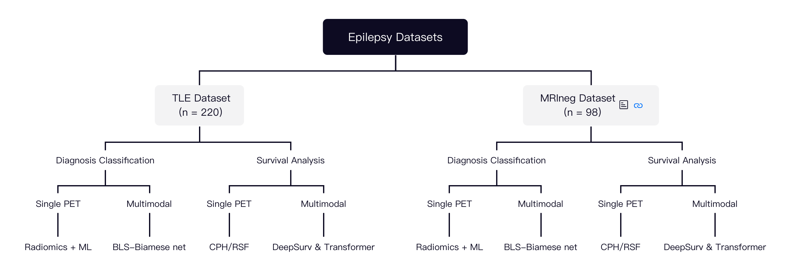
```
.footnote[]
---
class: center, middle
**Transformer架构**
```{r echo=FALSE}
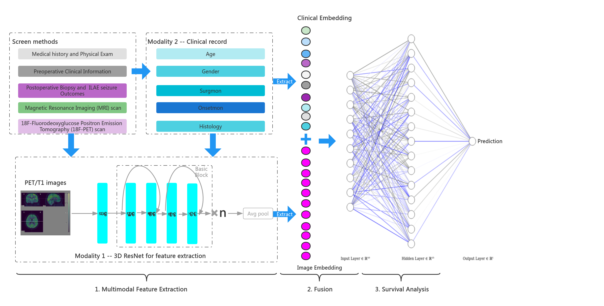
```
.footnote[]
---
class: center, middle
**MRI negative GBC classifier**
```{r echo=FALSE}
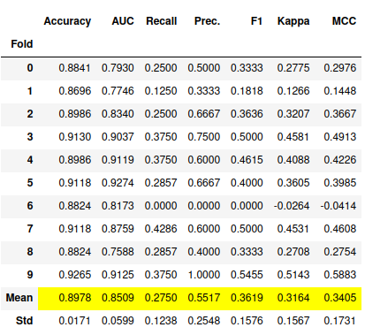
```

| Model | Accuracy | AUC | Recall | Precison | F1-score| Kappa | MCC |
| :-----: |  :-----: | :-----: | :-----: |  :-----: | :-----: |  :-----: | :-----: |
| GBDT |  0.8978 | 0.8509 | 0.2750 |0.5517|0.3619|0.3164|0.3405| 

---
# 吴环华工作汇报0725
## First
Lobes masks & Resampling

```{r echo=FALSE,out.width="150%"}
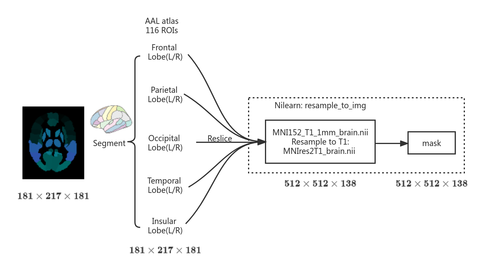
```
.footnote[]
---
name: MRIneg
## Second
98例MRIneg数据集(3 ~ 55 y, 21.0 y, 21.92 ± 10.54 y)年龄分层，38例儿童患者(38.8%，3 ~ 17 y, 13.21 y, 12.27 ± 3.74 y);[& TLE](#TLE-Child)
```{r echo=FALSE,out.width="100%"}
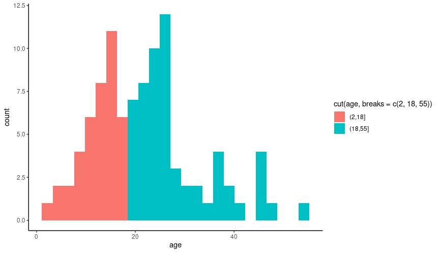
```
---
class: left, middle
```{r echo=FALSE,out.width="150%"}
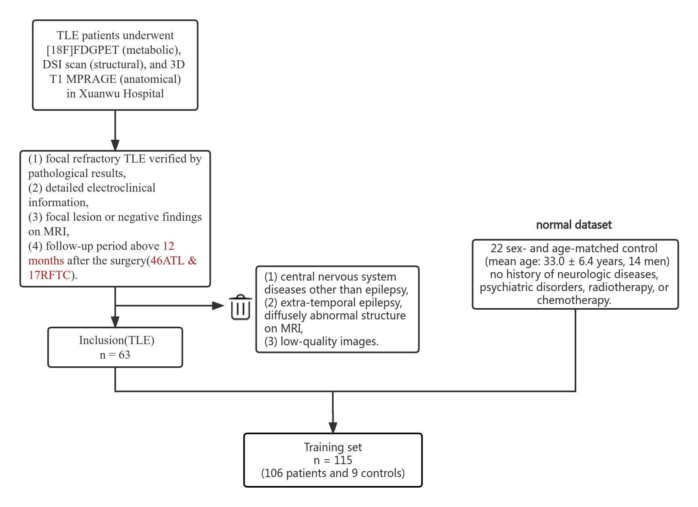
```
###### Wang, ZM., Wei, PH., Wang, C. et al. Combined [18F]FDG-PET with MRI structural patterns in predicting post-surgical seizure outcomes in temporal lobe epilepsy patients. Eur Radiol (2022). https://doi.org/10.1007/s00330-022-08912-2
---
class: center, middle
```{r echo=FALSE,out.width="90%"}
knitr::include_graphics("https://media.springernature.com/full/springer-static/image/art%3A10.1007%2Fs00330-022-08912-2/MediaObjects/330_2022_8912_Fig4_HTML.png?as=webp")
```
---
# 吴环华工作汇报0718
## First
A broad learning system for 18F–FDG PET/MRI imaging diagnosis in
temporal lobe epilepsy patients（定侧）；


## Second 
MLP模型拟合，

神经网络绘图([ML Visuals](https://github.com/dair-ai/ml-visuals))。
---
class: center, middle
```{r echo=FALSE,out.width="150%"}
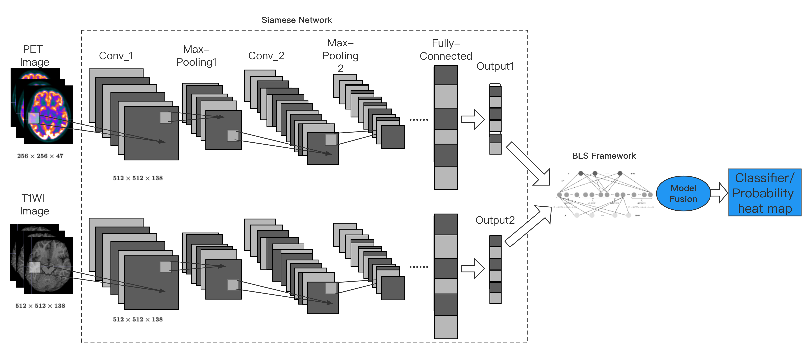
```
.footnote[Proposed Framework]

---
class: center, middle
```{r echo=FALSE,out.width="75%"}
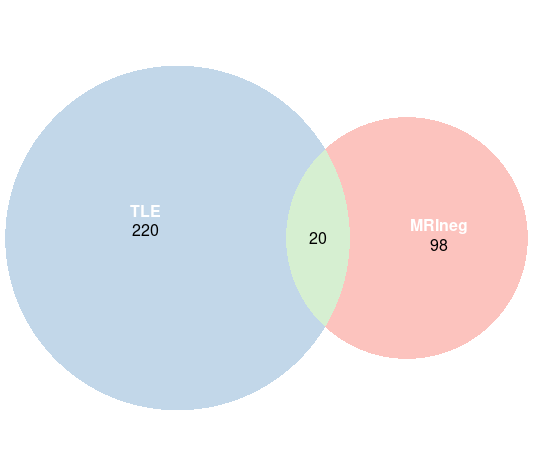
```
.footnote[数据集取交集]
---
.center[
| Model | Accuracy | AUC | Sensitivity |Specificity| Precison | F1-score| 
| :-----: |  :-----: | :-----: | :-----: |  :-----: | :-----: |  :-----: | 
| BLS-Siamese net |  0.914 | 0.998 | 0.753 |0.957|0.795|0.766|
| Siamese net|0.907 | 0.998 | 0.779 |0.949|0.756|0.763|
]
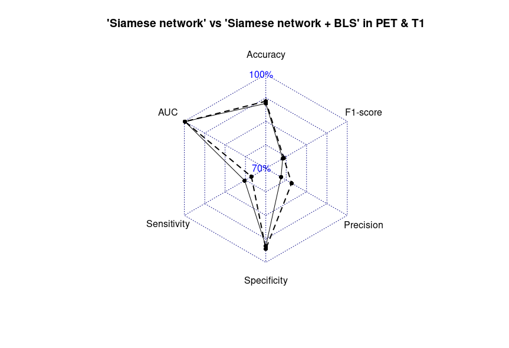
---
.center[
| Model | Accuracy | AUC | Sensitivity |Specificity| Precison | F1-score| 
| :-----: |  :-----: | :-----: | :-----: |  :-----: | :-----: |  :-----: | 
| BLS-Siamese net |  0.916 | 0.988 | 0.478 |0.909|0.509|0.435|
| Siamese net |0.825 | 0.990 | 0.508 |0.899|0.466|0.424|
| RF(radiomics) |0.827 | 0.995 | 0.479 |0.917|0.533|0.487|
| KNN(radiomics) |0.692 | 0.793 | 0.226 |0.953|0.403|0.286|
| MLP(radiomics) |0.734 | 0.885 | 0.265 |0.933|0.365|0.264|
]
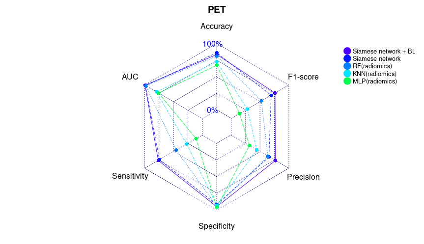
---
.center[
| Model | Accuracy | AUC | Sensitivity |Specificity| Precison | F1-score| 
| :-----: |  :-----: | :-----: | :-----: |  :-----: | :-----: |  :-----: | 
| BLS-Siamese net |  0.835 | 0.993 | 0.763 |0.952|0.766|0.762|
| Siamese net |0.860 | 0.985 | 0.742 |0.920|0.655|0.694|
| RF(radiomics) |0.810 | 0.979 | 0.453 |0.945|0.637|0.524|
| KNN(radiomics) |0.726 | 0.793 | 0.272 |0.930|0.444|0.279|
| MLP(radiomics) |0.673 | 0.759 | 0.108 |0.961|0.316|0.144|
]

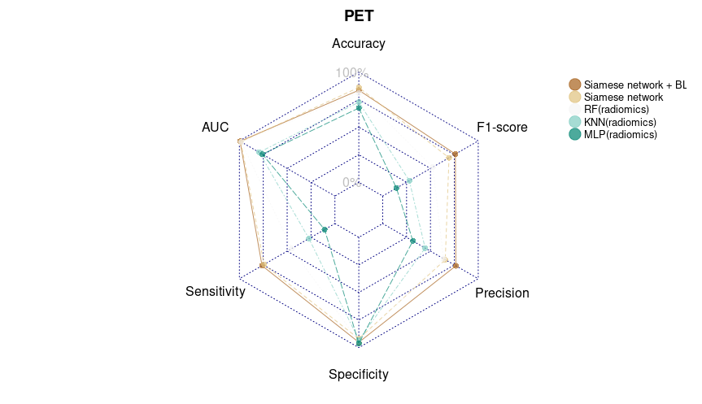
---
name: Annual
# 吴环华工作汇报0711
## First
Annual meeting abstract submission(Traditional Machine Learning Algorithms):

1、基于FDG PET代谢影像组学的一种新型评分系统用于颞叶癫痫术后复发预测(CPH);

[**2、基于18F-FDG PET影像组学的可解释性机器学习模型预测颞叶癫痫患者术后早期复发(DT、RF、GBDT);**](#SCI)

3、18F-FDG PET影像组学特征在颞叶癫痫患者术前诊断价值的研究(LR、NB、SVC、RF)。
## Second 
MLP神经网络搭建。

---
name: TLE-Child
## Third
234例颞叶癫痫数据集(3 ~ 60 y, 23.5 y, 25.50 ± 8.89 y)年龄分层，31例儿童患者(13.2%，3 ~ 17 y, 15.0 y, 13.92 ± 2.95 y); [& MRIneg](#MRIneg)
```{r echo=FALSE,out.width="90%"}
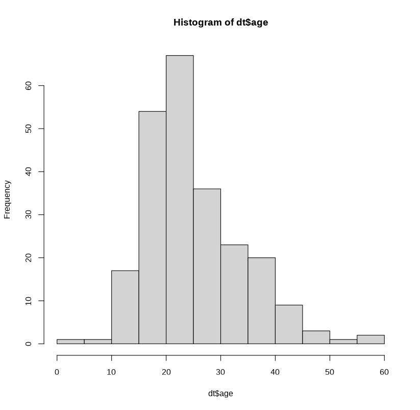
```

---
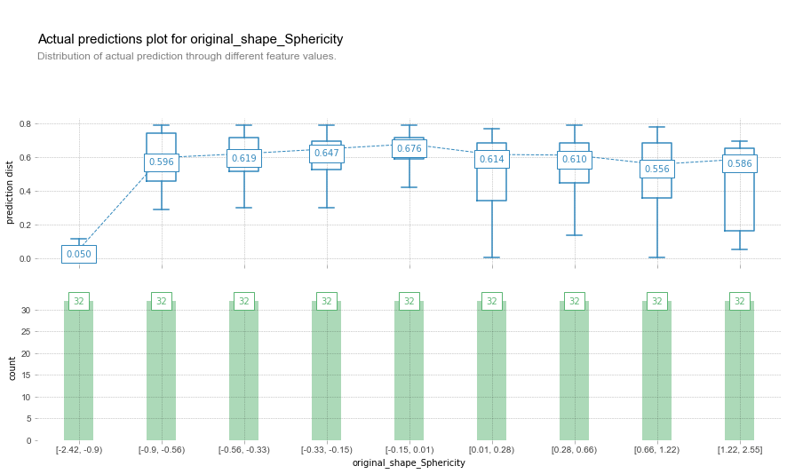
---
```{r echo=FALSE,out.width="80%"}
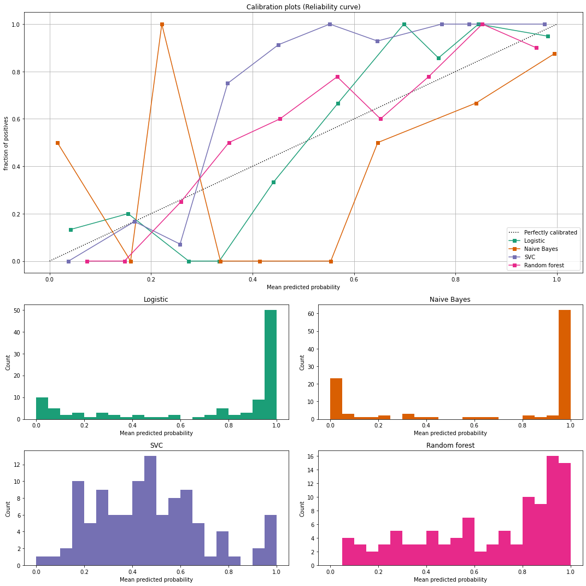
```
---
class: center, middle
.center[
| Classifier |  Brier loss | Log loss | Precison | Recall| F1 | AUC | 
| :-----: |  :-----: | :-----: | :-----: |  :-----: | :-----: |
| Logistic |  0.08 | 0.31 | 0.93 |0.94|0.93|0.89|
| Naive Bayes|0.22 | 1.89 | 0.84 |0.79|0.81|0.72|
| SVC|0.18 | 0.52 | 0.94 |0.93|0.93|0.90|
| Random Forest|0.13 | 0.40 | 0.87 |0.85|0.86|0.78|
]
???
Recall: 查全率也称为召回率，等价于灵敏性（Sensitivity）和真正率（True Positive Rate，TPR）
---
# 吴环华工作汇报0704
## First
MRIneg dataset预处理及标签文件创建；
## Second 
[复发预测模型文章撰写](https://github.com/wane199/Presentation/blob/master/BLS_EP/BLS_EP.pdf);
## Third
癫痫PET图像的组水平结构协变网络(SCNs)测试。
???
[xaringan of Rmarkdown to  render PPT](https://www.jianshu.com/p/222676cf2054)

xaringan::inf_mr() preview

Rmarkdown: $^{18}$F-FDG

overleaf: \usepackage{mhchem}  \ce{^{18}F-FDG}

---
## AAL116 Nets
.pull-left[
CN


]
.pull-right[
EP


]
---
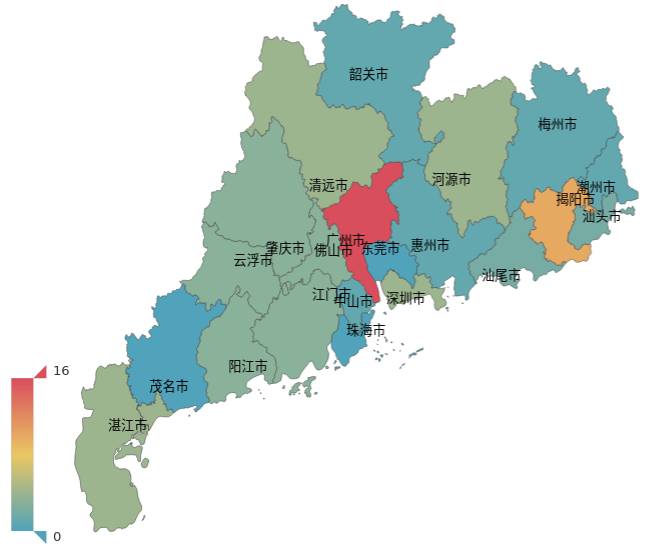
---
# 吴环华工作汇报0627

## First
98例MRI阴性图像(MRIneg dataset)预处理及标签文件创建；

## Second 
[复发预测模型文章撰写](https://github.com/wane199/Presentation/blob/master/BLS_EP/BLS_EP.pdf)；

## Third
数据预处理到模型部署的pipeline梳理。
---
class: center, middle
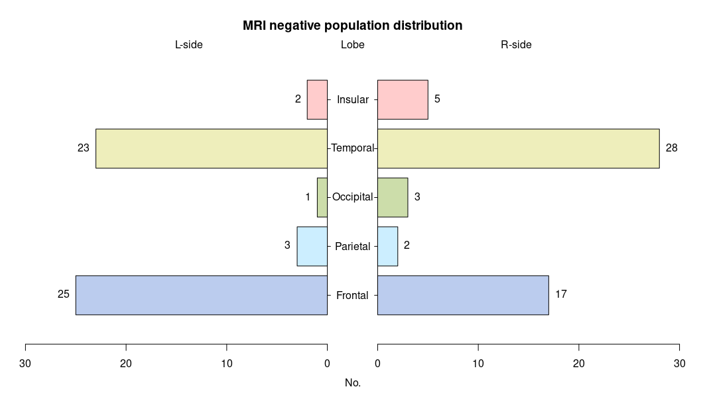
---
class: center, middle

Epilepsy Multimodal Neuroimaging x BLS
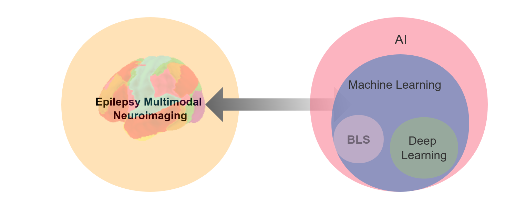
---
class: center, middle
```{r echo=FALSE,out.width="90%"}
knitr::include_graphics("./images/MLFan.png")
```
---
class: center, middle

# THANKS!

Data Source Provided by [Guangdong 999 Brain Hospital](https://www.999brain.com/Default.aspx).

[**JNU**]()<br>
[wane199@outlook.com](https://github.com/gadenbuie/xaringanthemer).
